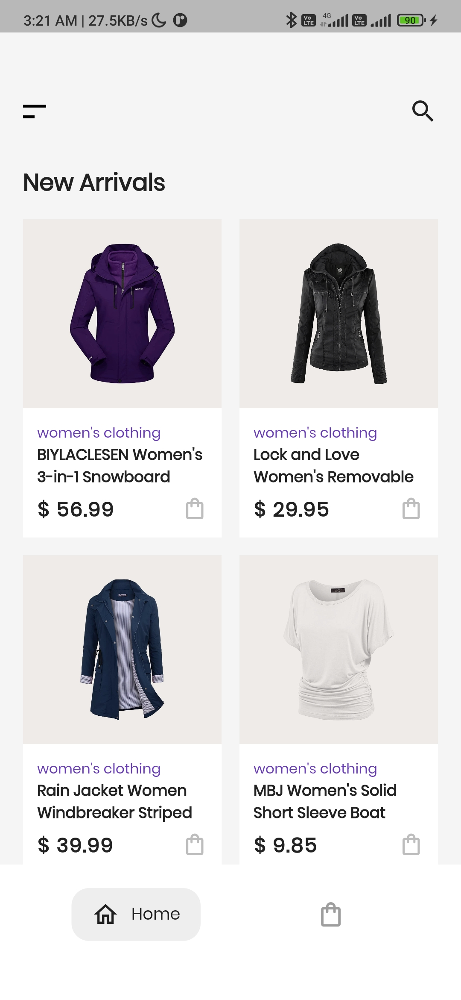
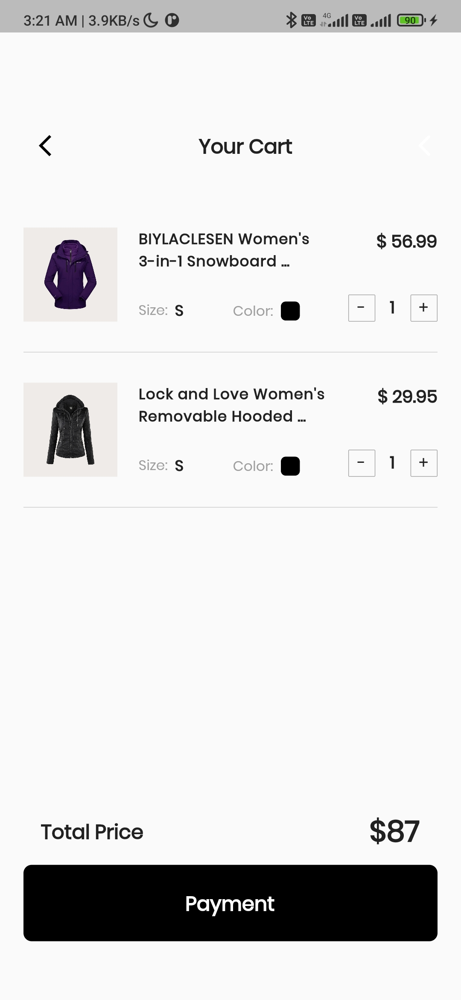

# 👗Fashion Store

> **UPDATE: This is the <ins>Mock Take Home Assignment</ins> for the Flutter Hiring Network initiative by [Pooja Bhaumik](https://twitter.com/pooja_bhaumik) and [Debasmita Sarkar](https://twitter.com/The__Debo)!**

A simple two page e-commerce app made with [provider](https://pub.dev/packages/provider) state management as an assignment for [ZuPay](https://www.zupay.in/).

- **Design** : [Figma](https://www.figma.com/file/rR5WkwVusaSmbZXfqPWEip/FashionStore?node-id=0%3A1)
- **API** : [Fakestoreapi](http://fakestoreapi.com/docs)

_Note: Proper flutter guidelines and architecture has been followed in the making of the application!_

A few resources to get you started if this is your first Flutter project

 

- [Lab: Write your first Flutter app](https://docs.flutter.dev/get-started/codelab)
- [Cookbook: Useful Flutter samples](https://docs.flutter.dev/cookbook)

For help getting started with Flutter development, view the
[online documentation](https://docs.flutter.dev/), which offers tutorials,
samples, guidance on mobile development, and a full API reference.

## 📱 Working

<table>
<tr>
<td></td>
<td></td>
<td></td>
</tr>
</table>

